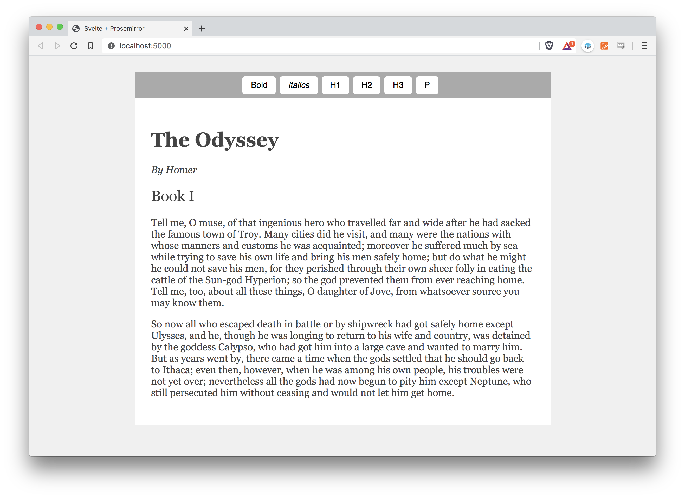

# Svelte + Prosemirror example
This is just a little demo with the absolute basics of ProseMirror and how to wire things up with Svelte.

#### Keyboard shortcuts
* <kbd>CMD</kbd> + <kbd>Z</kbd>: Undo
* <kbd>CMD</kbd> + <kbd>Shift</kbd> + <kbd>Z</kbd>: Redo
* <kbd>CMD</kbd> + <kbd>C</kbd>: Copy
* <kbd>CMD</kbd> + <kbd>V</kbd>: Paste
* <kbd>CMD</kbd> + <kbd>B</kbd>: Toggle bold
* <kbd>CMD</kbd> + <kbd>I</kbd>: Toggle italics
* <kbd>CMD</kbd> + <kbd>ALT</kbd> + <kbd>0</kbd>: Paragraph
* <kbd>CMD</kbd> + <kbd>ALT</kbd> + <kbd>1</kbd>: H1
* <kbd>CMD</kbd> + <kbd>ALT</kbd> + <kbd>2</kbd>: H2
* <kbd>CMD</kbd> + <kbd>ALT</kbd> + <kbd>3</kbd>: H3

In Windows use <kbd>Control</kbd> instead of <kbd>CMD</kbd>.

